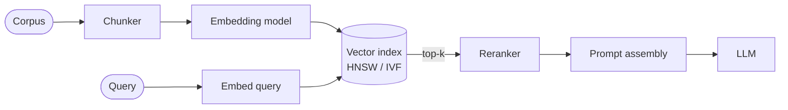

# Vector Search (Retrieval)

> **Bootstrap-stage note** (first exposure). Not exhaustive; deepen in the
> Transition/Mastery stages. Mirrors the System Design component style.

## 🎯 In one line
Turn text into vectors and find the *nearest* ones to a query vector fast — so an
LLM can be handed the most relevant chunks of a corpus instead of the whole thing.
This is the retrieval half of RAG.

## 🏗️ Where it sits & what talks to what

## 🧩 The core pieces

| # | Piece | Role |
|---|-------|------|
| 1 | **Chunking** | Split docs into retrievable units. Size/overlap is a real tradeoff: too big = noisy context; too small = lost meaning. |
| 2 | **Embeddings** | Map text → a fixed-length vector so "similar meaning" ≈ "close in space." |
| 3 | **Index (ANN)** | Approximate nearest-neighbor structure for sub-linear search. **HNSW** (graph) and **IVF/IVF-PQ** (clustered) are the workhorses. |
| 4 | **Metric** | cosine / dot / L2 — must match how the embeddings were trained. |
| 5 | **Rerank** | A cross-encoder re-scores the top-k for precision before the LLM sees them. |

## ⚖️ Key tradeoffs
- **Recall vs latency/memory** — HNSW `efSearch` / IVF `nprobe` trade accuracy for speed.
- **Exact vs approximate** — brute force is exact but O(N); ANN is the point once N is large.
- **Freshness** — incremental indexing vs periodic rebuilds; deletes are awkward in some indexes.
- **Hybrid** — BM25 (lexical) + vector (semantic) fused often beats either alone.

## 🔗 DSA connection
This *is* nearest-neighbor search in high dimensions — HNSW is a navigable
small-world **graph**; IVF is **clustering** + inverted lists. The interview-DSA
muscles (graphs, heaps for top-k, hashing) are the same ideas at scale.
