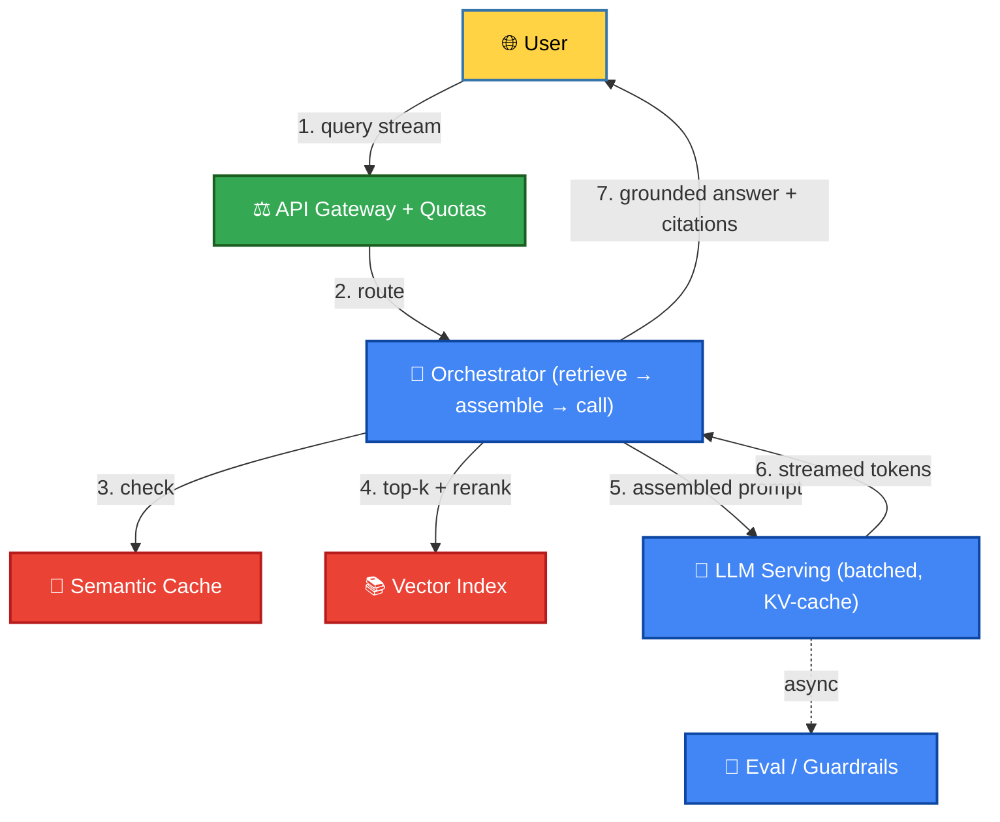

# 🤖 AI Build: [e.g., Design a RAG Chat Assistant over a Private Corpus]

> Fill this end to end during a Transition/Mastery rep. The scaffold **is** the
> rep — design each stage for a *concrete* system, don't just describe it.
> Mirrors the System Design case-study template, specialized for AI/LLM serving.

## 🗺️ Scope & Requirements

### 1. Functional Requirements (What it does)
* [ ] Requirement 1: e.g., user asks a question, gets a grounded answer with citations.
* [ ] Requirement 2: e.g., answer streams token-by-token.

### 2. Non-Functional Requirements (The boundaries)
* **Latency**: e.g., first token `< 1s`, full answer `< 5s` p95.
* **Cost**: e.g., token budget per request; cache hit-rate target.
* **Quality/Safety**: e.g., grounded-answer rate target; unsafe-output rate ceiling.
* **Scale**: e.g., QPS, corpus size (# docs / GB), concurrent sessions.

## 🔢 Back-of-the-Envelope Estimation
* **Corpus**: e.g., 2M docs × 4 chunks × 768-dim float32 → `~24 GB` of vectors.
* **Traffic**: e.g., 50 QPS, avg 3K prompt tokens + 500 completion tokens.
* **Cost**: e.g., tokens/request × QPS × price → $/day; cache to cut it.

## 📥 Ingestion & Indexing Pipeline
* **Chunking**: strategy + size/overlap and why (semantic vs fixed-window).
* **Embeddings**: model, dimensionality, batch size, incremental re-embed on update.
* **Index**: HNSW / IVF-PQ choice + params (M, efSearch / nlist), metric (cosine/dot).
* **Hybrid**: BM25 + vector? rerank stage (cross-encoder)?

## 🔎 Retrieval & Context Assembly
* **Retrieve**: top-k, filters/metadata, hybrid fusion.
* **Rerank**: model + how many candidates in → out.
* **Context budget**: how you rank/compress/select to fit the window; citation carry-through.
* **Semantic cache**: key, TTL, hit path.

## 🧠 Serving Path
* **Streaming**: SSE / WebSocket; first-token vs full-completion handling.
* **Batching / KV-cache**: request batching, GPU scheduling, autoscaling for spikes.
* **Quotas / rate limiting**: per-tenant token buckets; degradation/fallback under load.

## 🧪 Evaluation & Guardrails
* **Offline**: golden set, retrieval recall@k, answer grading (LLM-as-judge + pitfalls).
* **Online**: canary, A/B, live grounding/hallucination checks.
* **Safety**: input/output filters; what happens on a block.
* **Rollout**: canary + rollback for prompt/model/index changes.

## 🗺️ Macro System Visual Map

