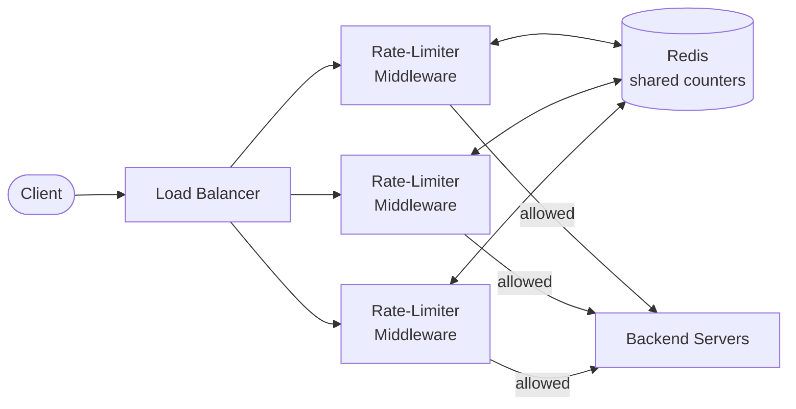
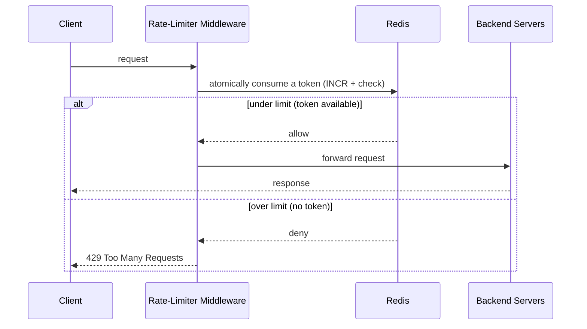

# Rate Limiter

> **Bootstrap-stage note** (first exposure — from the ByteByteGo overview + recall). Not exhaustive; deepen in the Transition/Mastery stages.

## 🎯 In one line
Caps how many requests a user can make in a time window — to **protect the backend** from abuse, overload, and runaway cost. Over-limit requests are rejected *before* they reach the servers.

## 🏗️ Where it sits & what talks to what



Lives as **middleware** between client and servers, typically near where auth happens. (A *custom* algorithm can instead live inside a service — reasonable when you need app-specific logic.)

## 🧩 The 3 core components

| # | Component | Role |
|---|-----------|------|
| 1 | **Rules / policy** | What limit applies, and to whom (per-user / per-IP / per-endpoint) |
| 2 | **Counter store (Redis)** | The shared, fast state — how many requests / tokens each user has |
| 3 | **Algorithm + decision** | Token bucket (below) → allow or reject |

## 🔁 Request flow



The check is an **atomic read-modify-write** ("consume a token *and* check" in one step), so concurrent requests can't both slip through.

## 🪣 Token bucket (the standard algorithm)
A bucket holds up to `N` tokens and **refills over time** (e.g. +1/sec). Each request removes one token; no token → rejected.

```
[ 🪙🪙🪙🪙🪙 ]  ← bucket, capacity N, refills at a fixed rate
      │  each request consumes 1 token
      ▼
  token left? ──yes──► allow
      │
      └──no──► reject (429)
```
Bursts up to `N` are allowed; sustained rate is capped at the refill rate.

## 🧠 Why Redis (not the middleware's own memory)?
The middleware is **many identical instances** behind the load balancer, each with its *own* memory. A user hitting different instances would bypass a per-instance counter:

```
Instance A: {userX: 1}
Instance B: {userX: 1}   ← doesn't know A already counted → limit bypassed
Instance C: {userX: 1}
```

Redis is **one shared, in-memory store** all instances read/write, so the count is **global**. Chosen because it's:
- **Fast** (in-RAM → microseconds; hit on *every* request)
- **Atomic** (`INCR` avoids race conditions across concurrent requests)
- **Expiring** (TTL auto-resets windows / refills — no manual cleanup)

**Division of labor:** middleware = *logic* (allow/reject); Redis = *shared state* (the counts).

## ⚖️ Tradeoffs
- **Placement:** middleware (general, central) vs in-service (custom logic).
- **Accuracy vs performance:** a perfectly-accurate distributed counter needs synchronization that adds latency; real systems accept small inaccuracies for speed.

## 🔭 To deepen later (Transition/Mastery)
- Other algorithms: leaky bucket, fixed window, sliding-window log / counter.
- Distributed rate limiting details (sync, race conditions across the cluster).
- Reject UX: `429` + `Retry-After` header.
- Rule granularity: per-user vs per-IP vs per-endpoint, tiered limits.
