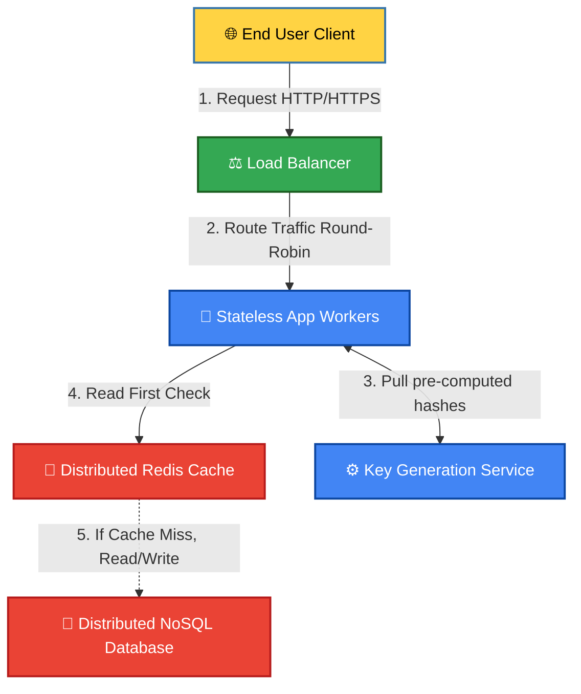

# 🏢 Case Study: [e.g., Design a URL Shortening Service (TinyURL)]

## 🗺️ System Scope & Requirements

### 1. Functional Requirements (What the system does)
* [ ] Requirement 1: User inputs a long URL and receives a short, unique alias URL.
* [ ] Requirement 2: User clicks a short URL and is instantly redirected to the original long URL.

### 2. Non-Functional Requirements (The architectural boundaries)
* **Scale**: High Read-to-Write Ratio (e.g., 100 read requests for every 1 write request).
* **Availability**: Highly available (`99.999%` uptime); redirection must take `< 100ms`.
* **Consistency**: Eventual consistency is acceptable; it doesn’t matter if a newly created short URL takes 2 seconds to propagate globally, as long as it never crashes.

## 🔢 Back-of-the-Envelope Estimation (Scale Assumptions)
* **Write Traffic**: 1 million new URLs created per day \(\rightarrow\) `~12 requests/second`.
* **Read Traffic**: 100 million URL redirects per day \(\rightarrow\) `~1,160 requests/second`.
* **Storage Needed (5 Years)**: 1 million * 365 * 5 = 1.8 billion records. If each row takes 500 bytes, `1.8B * 500 bytes = 900 Gigabytes` total disk storage needed.

## 🗄️ Storage Data Modeling
* **Database Choice**: NoSQL Key-Value Store (e.g., DynamoDB or Cassandra).
* **Reasoning**: We do not require complex table joins or relational grouping. We only need lightning-fast, highly scalable lookups using a single key string (`short_hash`).

```text
Table: URL_Mapping
├── hash_key (String, Primary Key)  <-- e.g., "7bXq2"
└── original_url (String)           <-- e.g., "https://example.com"
```

## 🏗️ High-Level System Architecture Design
1. **API Gateway & Rate Limiter**: Filters incoming traffic, throttling malicious IP addresses via a token bucket token rule.
2. **Application Workers**: Stateless Python/Go web worker nodes handling incoming strings.
3. **Key Generation Service (KGS)**: An independent service that pre-computes unique hash strings in the background. This avoids runtime hashing string collision bottlenecks during writes.
4. **Cache Stratum**: A distributed cluster storing the top 20% most popular mappings to bypass physical database lookups entirely during peak traffic periods.

## 🗺️ Macro System Visual Map

