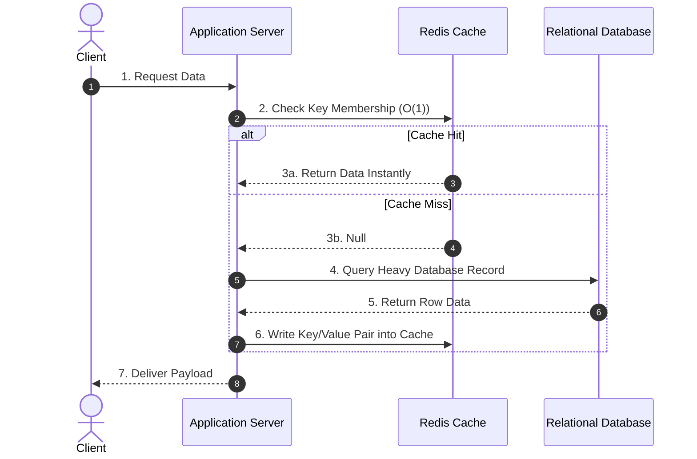

# 🧱 Component Name: [e.g., Distributed Cache]

## 🎯 1-Sentence Metaphor
* [Write a plain-English analogy: e.g., A Distributed Cache is like a sticky-note on your monitor containing your most used passwords so you don't have to open a heavy lockbox every time.]

## 🧠 Underlying DSA Connection
* **Core Data Structure**: [e.g., Doubly Linked List + Hash Map (LRU Cache)]
* **Algorithmic Complexity**: Lookup: `O(1)` | Eviction: `O(1)`
* **Data Flow Pattern**: [Describe how data moves structurally through the component in 1 sentence]

## 📋 Core Architectural Configurations
### 1. Strategy Options / Patterns
* **Option A**: [e.g., Cache-Aside (Lazy Loading) - App checks cache, if miss, queries DB and updates cache.]
* **Option B**: [e.g., Write-Through - App writes to cache, cache synchronously writes to DB.]

### 2. Eviction Policies
* **LRU (Least Recently Used)**: Evicts the least recently accessed item using a linked list.
* **LFU (Least Frequently Used)**: Evicts items with the lowest access count frequency.

## 🚨 Operational Bottlenecks & Failure Modes
* **Failure Mode 1 (Thundering Herd / Cache Stampede)**: Occurs when a popular cached key expires, causing millions of concurrent requests to hit the database at the exact same moment. 
  * *Mitigation*: Implement a mutex lock (probabilistic early expiration or locking) so only one server queries the database while others wait for the cache to re-populate.
* **Failure Mode 2 (Cache Penetration)**: Requests look for keys that do not exist in either the cache or the database, forcing a constant database lookup loop.
  * *Mitigation*: Use a **Bloom Filter** data structure at the gate to instantly reject non-existent keys.

## 🗺️ Visual Architecture Flow

