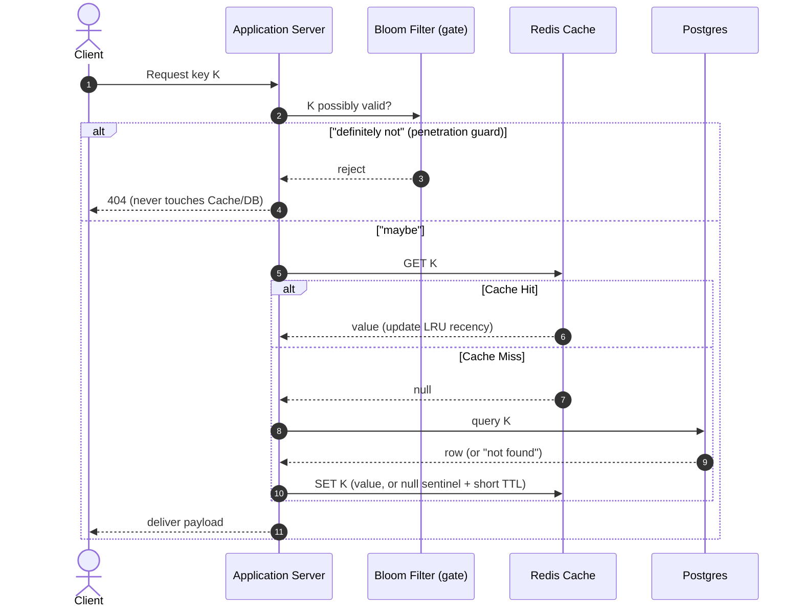

# 🧱 Component: Caching

> Bootstrap note — built Jul 22, 2026 (derive-the-design session). Rated rep is the later blind-sprint rebuild.

## 🎯 1-Sentence Metaphor
A cache is a **small, fast desk drawer** in front of a **big, slow warehouse (the DB)**: you keep the
handful of things you reach for constantly within arm's reach, and only walk to the warehouse for the
rest. It only pays off because you reach for a *few* things far more than the rest (see Zipf, below).

## 🧠 Underlying DSA Connection
* **Core Data Structure**: Hash map for O(1) lookup + a doubly-linked list for O(1) LRU eviction (the
  146 LRU Cache build). A **Bloom filter** guards the gate against penetration (see Core Concepts).
* **Algorithmic Complexity**: Lookup `O(1)` · Eviction `O(1)` · Bloom membership `O(k)`.
* **Data Flow Pattern**: App checks the fast store first; on a miss it falls through to the slow store
  and (lazily) repopulates. The cache never knows the DB exists — the *app* orchestrates both.

---

## Pillar 1 — Why caching works at all: access skew

A cache is only useful when reads are **skewed** — a small hot set served far more than the long tail.
The metric is **hit ratio** (fraction of reads served from cache), **not** the cache/catalog size ratio.

* Worked example: 100k reads/sec on a catalog Postgres can only serve at ~10k/sec. If the hot set fits
  in cache and yields a **95% hit ratio**, only ~5k reads/sec reach Postgres → under the ceiling. The
  cache is what makes the read load *survivable*.
* **Uniform access ⇒ cache is useless.** No skew means a small cache catches almost nothing. This is
  why real read traffic being **Zipfian** (Core Concepts §A) is the load-bearing assumption.
* **Quantify & qualify it aloud:** *"Assuming ~90% hit ratio from Zipfian access, DB reads drop to
  ~10k/s; if access flattens — a scraper walking the whole catalog — the hit ratio craters and the DB
  eats the full load."*

## Pillar 2 — The read path: cache-aside (lazy loading)

1. App checks the cache for the key.
2. **Hit** → return it (update recency for LRU).
3. **Miss** → read from Postgres, **write it into the cache**, return it. Evict (LRU) only if the cache
   is *full*.

Properties: only requested items ever enter the cache (lazy); the **app** populates it, not the cache;
the cache has no knowledge of the DB. Alternatives (read-through / write-through) push that
orchestration into the cache layer — cache-aside is the default because it's simple and the app stays
in control.

## Pillar 3 — The write path: invalidate, don't update

Problem: a write changes the DB (price \$10 → \$8) but the cache still holds the old \$10 → stale read.
The write path must deal with the cached copy. Two options:

* **(A) Update in place** — write \$8 into the cache too.
* **(B) Invalidate** — *delete* the key; the next read misses and reloads \$8 from the DB. ✅ **Preferred.**

**Why invalidate beats update — concurrency / idempotency.** Update-in-place has a permanent-divergence
race: a read-miss reads old \$10 and is about to cache it; meanwhile a write sets DB+cache to \$8; then
the slow read finishes and writes stale \$10 into the cache → **cache says \$10, DB says \$8, and stays
wrong until TTL.** Deleting is **idempotent** — two deletes, or a delete racing a read, can't strand a
wrong value; worst case is an extra miss that reloads the true current value.

* **TTL as backstop:** even if an invalidation is *missed* (app crashes mid-write, dropped delete), the
  TTL eventually expires the stale entry and it reloads. Practice = **invalidate-on-write + TTL** (belt
  and suspenders).

## Eviction Policies
* **LRU (Least Recently Used)** — evict the least-recently-touched item; hash map + doubly-linked list,
  O(1). The default; matches "hot set stays resident."
* **LFU (Least Frequently Used)** — evict the lowest access-count. Better for stable popularity, worse
  for shifting trends (a formerly-hot item lingers).

---

## 🚨 Failure Modes

### Thundering herd / cache stampede
A blazing-hot key (say 50k reads/sec, all cache-served) hits its TTL and expires. In that instant **all
50k concurrent requests miss simultaneously**, and — since none has repopulated yet — every one **fans
out to Postgres with the same query.** One expired key → a 50k/sec spike of *identical* DB reads → DB
trampled. The danger is the **empty-key window**, not the cache itself (the cache cheaply says "miss").

**Mitigations** (prevent the empty window, or gate who passes through it):
* **Per-key lock / single-flight** — first miss grabs a lock on that key (`SET lock:K … NX`), reloads,
  repopulates, releases; everyone else waits + retries the cache (or serves stale). 50k misses → **1 DB
  query.** The lock is **per-key** — only that one contended key serializes; all other traffic flows.
* **Serve-stale-while-revalidate** — keep serving the old value while one background request refreshes;
  the key is never empty.
* **Early / probabilistic recompute** — refresh a hot key *before* expiry (each read has a small,
  rising-near-expiry chance to trigger a proactive reload), so it never reaches zero.
* **Jittered TTLs** — randomize expiry so a batch loaded together doesn't all expire on the same tick
  (fixes the *many-keys* correlated stampede; composes with the per-key lock).

### Cache penetration
Requests for keys that exist in **neither** cache **nor** DB (fake/nonexistent IDs). Cache-aside: miss →
DB "not found" → nothing to cache → repeats forever. A flood of **distinct** fake IDs bypasses the cache
entirely (every one a DB hit) **and** pollutes it with null entries that evict real hot data.

**Mitigations:**
* **Negative caching** — cache the "does not exist" fact (null sentinel, short TTL). Kills *repeated*
  fakes. Does **not** help *distinct* fakes (each is a fresh miss + fills cache with garbage).
* **Bloom filter of valid keys at the gate** (Core Concepts §B) — reject IDs that "definitely don't
  exist" in memory, before cache/DB. Handles the high-cardinality distinct-ID flood. **Never
  false-negatives** (won't block a real key); **may false-positive** (rare fake slips to the normal
  path — a harmless efficiency leak).

---

## ⚖️ Decision Rationale
* **Reach for a cache when**: read-heavy + skewed access + tolerable staleness. Trigger = read QPS
  approaches the datastore's ceiling and the working set is much smaller than the whole dataset.
* **Prefer the alternative when**: writes dominate, access is ~uniform (no hot set → near-zero hit
  ratio), or the data must be *strongly* consistent (a cache is an eventual-consistency layer).
* **Key tradeoff accepted**: **freshness for latency** — you accept a bounded staleness window (TTL +
  invalidation lag) in exchange for absorbing most reads in memory.
* **Write path** → **invalidate (delete), not update** — idempotent/race-safe; in-place update can leave
  cache↔DB permanently divergent. Cost: one extra miss per write.

## ❓ Likely Questions (rehearse the defense)
* "Why a cache and not a bigger/replicated DB?" → cheaper to absorb a skewed read spike in memory than
  to scale the DB for the same QPS; cache targets the *hot set*, replicas copy *everything*.
* "What happens when it fills up?" → eviction (LRU) drops the coldest item; hit ratio degrades
  gracefully as the working set outgrows m.
* "A hot key just expired under a spike — now what?" → thundering herd → per-key lock / serve-stale /
  early recompute (above).
* "Someone floods you with IDs that don't exist?" → cache penetration → negative caching + Bloom filter.
* "How do you keep it consistent with the DB?" → invalidate-on-write + TTL backstop; name the staleness
  window and why it's acceptable for *this* data (a 2s-stale price is fine; a balance isn't).

## 🗺️ Visual Architecture Flow

---

# 📚 Core Concepts (the ideology under the design)

> These two ideas are *why the design works*, not part of the design — and they recur well beyond
> caching, so they've been **extracted to their own notes** (single source of truth). Summaries here;
> full mechanics, derivations, and Recall Cards in the linked files.

## §A — Zipfian distribution → [`../concepts/zipfian_distribution.md`](../concepts/zipfian_distribution.md)

Request frequency ∝ **1/rank** (a power law), so a tiny head of popular items carries most of the total
volume. That skew is *why* a small cache catches a large fraction of reads — **hit ratio tracks access
skew, not cache/catalog size.** No skew (uniform access, a scraper walking everything) → the cache buys
nothing, and "95% hit ratio" is a modeling assumption to state and defend. Full shape, the `s`-exponent,
the "rich-get-richer" origin, and the hot-shard flip-side are in the concept note.

## §B — Bloom filter → [`../concepts/bloom_filter.md`](../concepts/bloom_filter.md)

A bit array + k hashes answering *"possibly present / definitely absent"* in `O(k)` time and a few bits
per key — **never false-negative** (safe to reject on "definitely no"), **may false-positive** (rare fake
slips to the normal path). It's the space-cheap whitelist that guards the penetration gate against a
high-cardinality fake-ID flood. Full mechanics, the `k = (m/n)·ln 2` optimum + symmetry derivation, the
no-delete gotcha, and where it recurs (dedup, SSTables, spell-checkers) are in the concept note.
